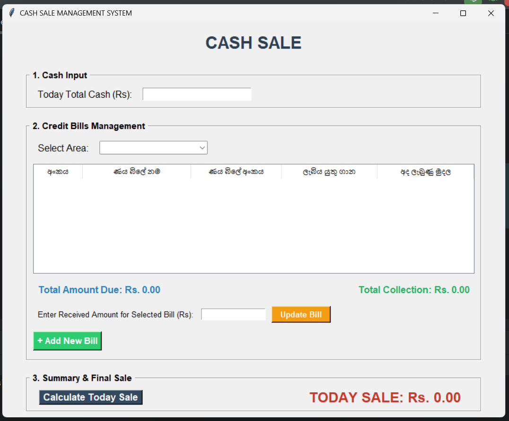

# Cash Sale Management System 📊

[](https://www.python.org/)
[](https://www.sqlite.org/)
[](https://docs.python.org/3/library/tkinter.html)

**Cash Sale Management System** is a desktop application designed for distribution and retail businesses to easily manage daily cash collections and credit bills.

---

## 🎯 Purpose
The main purpose of this system is to simplify daily sales calculations. It allows you to input the total cash received for the day, deduct the payments collected from credit bills (separated by area), and automatically calculate the accurate **Net Daily Sale**.

---

## 📸 Screenshots
> 💡 **Note:** Upload your application screenshots to GitHub and replace the placeholder URLs below with your actual image links.

### Main Dashboard


### Add New Bill Form


---

## ✨ Features
- 💰 **Cash Input:** Enter the total cash collected during the day.
- 🗺️ **Area-wise Credit Management:** View and manage credit bills based on different regions (Area 1, Area 2, Area 3).
- 🔄 **Real-time Tracking:** Update bill balances instantly upon payment. Fully settled bills are automatically removed from the active view.
- 🧮 **Automated Sale Calculation:** Calculate the final **Today Sale** accurately with a single click.
- 📝 **Dynamic Data Entry:** A simple popup form to add new credit bills on the go.

---

## 🛠️ Technologies Used
- **Language:** Python 3.x
- **GUI Framework:** Tkinter (Python Standard Library)
- **Database:** SQLite3 (Lightweight, local relational database)

---

## 🗄️ Database Schema
The system automatically creates a local SQLite database named `distribution.db`. It contains the following table structure:

### `credit_bills` Table
| Field Name | Data Type | Description |
| :--- | :--- | :--- |
| **id** | INTEGER (PK) | Unique auto-incrementing ID for each bill |
| **area** | TEXT | The area/region assigned to the bill |
| **bill_name** | TEXT | Customer or business name |
| **bill_number**| TEXT | The unique reference number of the credit bill |
| **amount_due** | REAL | The remaining outstanding balance |

---

## 🚀 How to Run

### Prerequisites
Make sure you have Python 3 installed on your computer. (Tkinter and SQLite3 come pre-installed with Python, so no extra installations are needed).

### Steps:
1. Clone this repository or download the source code as a ZIP file.
   ```bash
   git clone [https://github.com/YOUR_USERNAME/YOUR_REPOSITORY_NAME.git](https://github.com/YOUR_USERNAME/YOUR_REPOSITORY_NAME.git)
